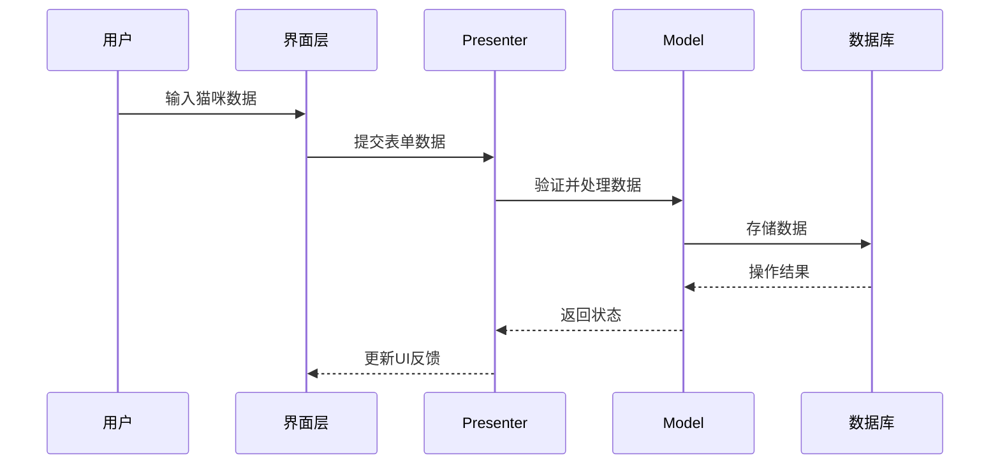
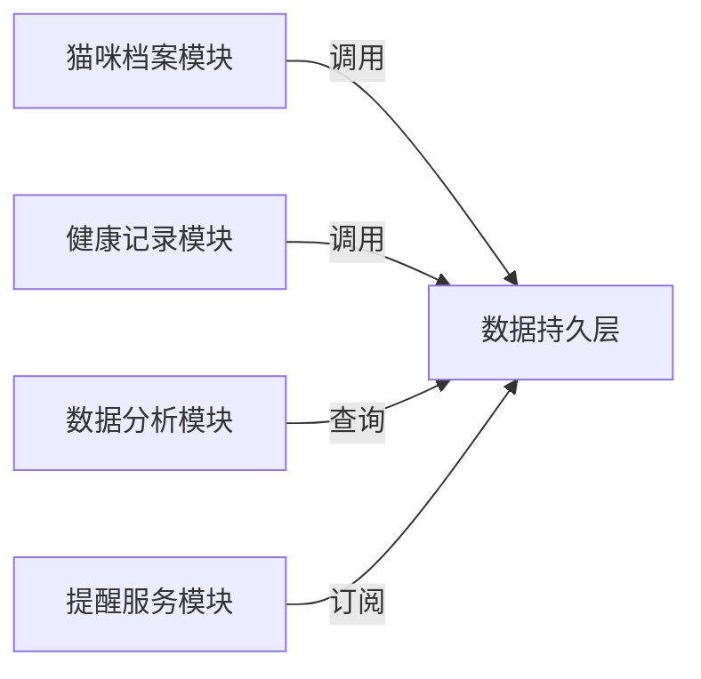
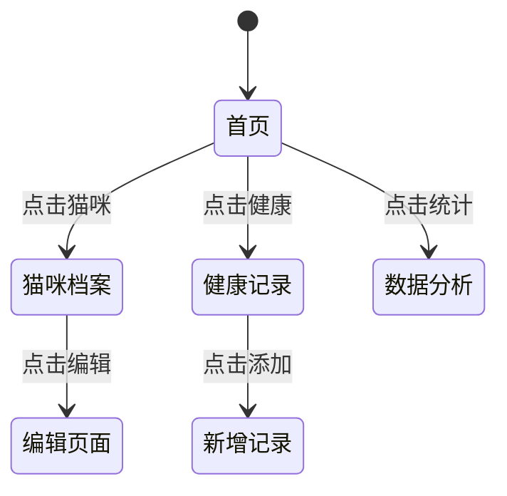

# HomeCat 交互流程图

## 1. 核心数据流

```mermaid
sequenceDiagram
    participant 用户
    participant 界面层
    participant Presenter
    participant Model
    participant 数据库
    
    用户->>界面层: 输入猫咪数据
    界面层->>Presenter: 提交表单数据
    Presenter->>Model: 验证并处理数据
    Model->>数据库: 存储数据
    数据库-->>Model: 操作结果
    Model-->>Presenter: 返回状态
    Presenter-->>界面层: 更新UI反馈
```

## 2. 模块交互关系

```mermaid
graph LR
    A[猫咪档案模块] -->|调用| B[数据持久层]
    C[健康记录模块] -->|调用| B
    D[数据分析模块] -->|查询| B
    E[提醒服务模块] -->|订阅| B
```

## 3. 界面跳转逻辑

```mermaid
stateDiagram-v2
    [*] --> 首页
    首页 --> 猫咪档案: 点击猫咪
    首页 --> 健康记录: 点击健康
    首页 --> 数据分析: 点击统计
    
    猫咪档案 --> 编辑页面: 点击编辑
    健康记录 --> 新增记录: 点击添加
```

## 4. 技术实现要点
1. Presenter层负责协调View和Model的通信
2. 使用TypeORM实现数据模型到SQLite的映射
3. 跨平台代码通过process.platform区分实现